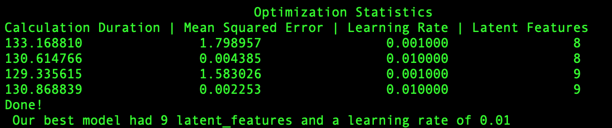

# Movie Recommendation Engine

## Table of Contents
1. [Installation and Instructions](#Installation)
2. [Project Motivation](#Motivation)
3. [File Descriptions](#Descriptions)
4. [Discussion](#Results)
5. [Acknowledgements](#Acknowledgements)

# Installation and Instructions :
There should be no necessary libraries to run the code here beyond the Anaconda distribution of Python which can be found [here](https://www.anaconda.com/). The code should run with no issues using Python versions 3.

1. Run the following commands in the project's root directory to set up your database and model.

    - To run following Recommendation Engine, you will need to call the following calls in your Terminal.
        - `python`
        - `from recommender_template import Recommender`
        - `rec = Recommender('train_data.csv','movies_clean.csv')`

`

2. You can now run any of the methods in the recommender_template.py file. For instance:
    - `rec.best_params(latent_features_list=[8,9],learning_rate_list=[0.001,0.01])`

# Project Motivation 

After reviewing course material in the Udacity Nanodegree on SVD (Single Value Decomposition) and its use in recommendation engines I decided to create a python package that could automate the function. Currently there is only an SVD function available for distribution as a part of the NumPy package.

I tailored the SVD algorithm with gradient descent to mimic the FunkSVD algorithm so we can deal with missing values.

# File Descriptions 

#### recommender_template.py
The recommender_template file contains the `Recommender` class and its various objects.

#### recommender_functions.py
This file contains a set of functions that are routinely called upon in our recommender_template for many of the methods.

#### movie_clean.csv
A dataset with columns: movie_id, movie, genre, date, years (one hot encoded), genres (one hot encoded)

#### train_data.csv
A dataset with columns: user_id, movie_id, rating, timestamp, date, month(one hot encoded), years (one hot encoded).

# Discussion 

Stay tuned for a blog post on my [Medium](https://medium.com/@surohittandon123) blog.

# Acknowledgements 

Thanks must go to Udacity for providing a dataset so that I could test and develop this package.
